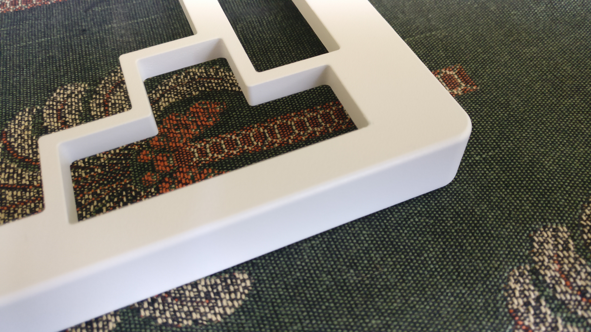

# Received parts from the CNC manufacturer

Those are the parts received from the CNC manufacturer, Xometry EU.  
The bottom case parts (3 in aluminium 6061, 1 in brass) are kept raw with only a fine grit glass bead blast finish. I will not keep them all like that; the copper and one aluminium bottom will be polished by hand on the outside, the copper part will also receive a forced patina with the use of white vinegar (on the inside only).  
The top case parts(4 in aluminium 6061) have been powder coated with a matte RAL 9010 color.  

At this stage I tested that they were no fitment issues with all the parts, that is top/bottom case, plate, PCB and screws.

