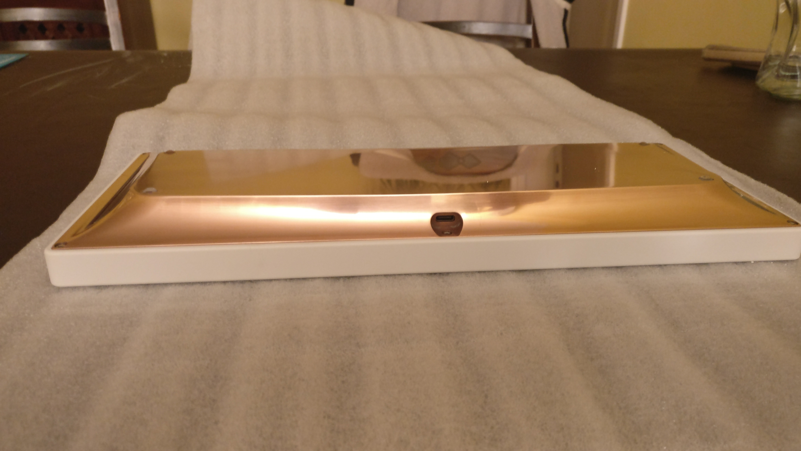
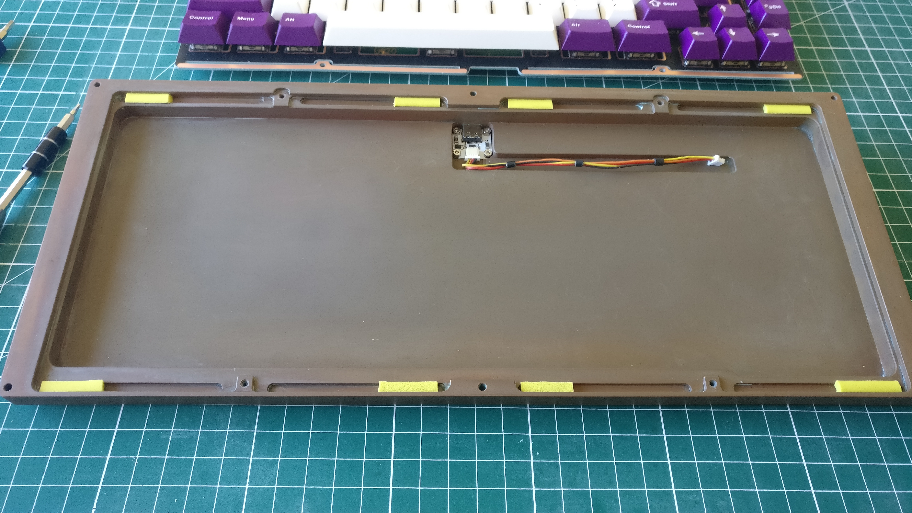
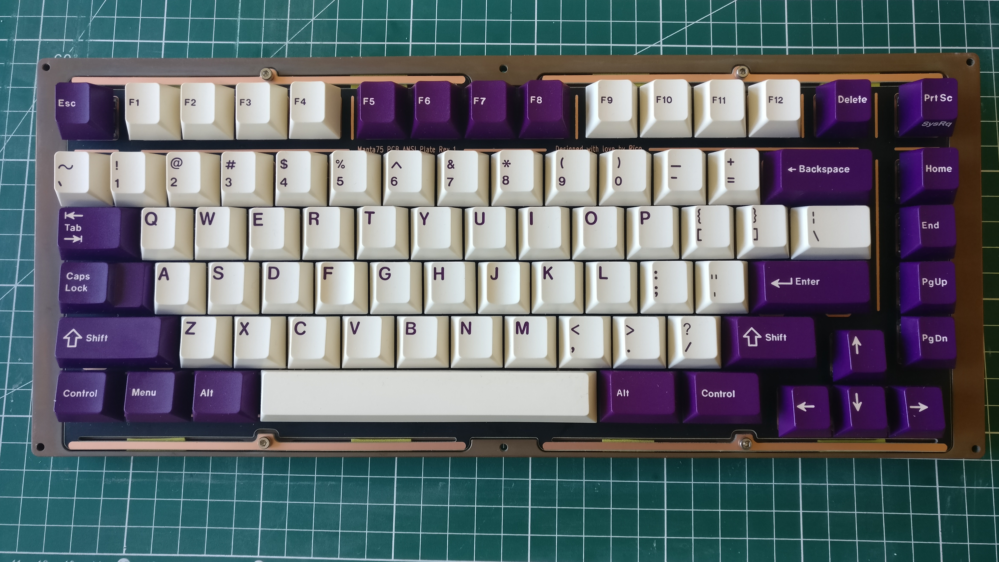
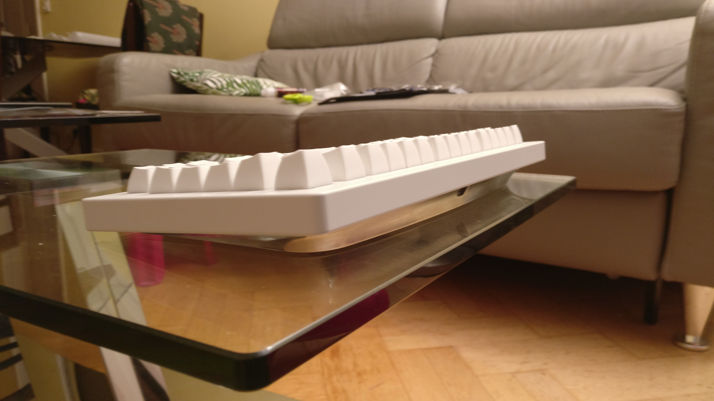

# Parts preparation and assembly

## Mistakes were made

Despite great efforts to test fit all the parts in Fusion 360, small design errors on the bottom case prevented the plate to flex.

That's a bummer but you can't always make things right the first time, that is the purpose of doing prototypes.  
Fortunately only a bit of Dremeling on the plates fixed the issue and you can't see anything when the keyboard is fully assembled.

Note:
The STEP files for the case provided in this repository have this problem fixed.

## Bottom case polishing

The copper and one aluminium bottom case have been brushed and polished by hand.  
The bottom section have been brushed with 500 grit sand paper.  
The side sections have been sanded with 280, 500, 1000, 2000 and finally 5000 grit sandpaper. 

## Plate preparation and fitting

Laser cut aluminium 5052 plates have also been brushed using 500 grit sandpaper.  
You can see on the second image the dirty Dremeling work on the plate (on the top right) to allow it to freely flex.

## Plate/PCB installation with gaskets

The gaskets have been crudely cut with a scissor on a Poron XRD sheet, not very straight and aestically pleasing but they friction fit perfectly and don't move from the bottom case grooves.  
Tested with gaskets installed on the end of the leaves and on the middle.  

You can see the copper patina done by just rubbing white vinegar on it and let it dry.

My preference is with the gaskets on the middle for linear switches.

## Full assembly

### My personal board with copper bottom.

### My friend's board with aluminium bottom

Using ISO AZERTY keycaps.

