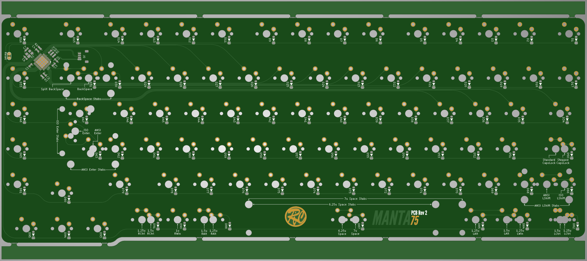
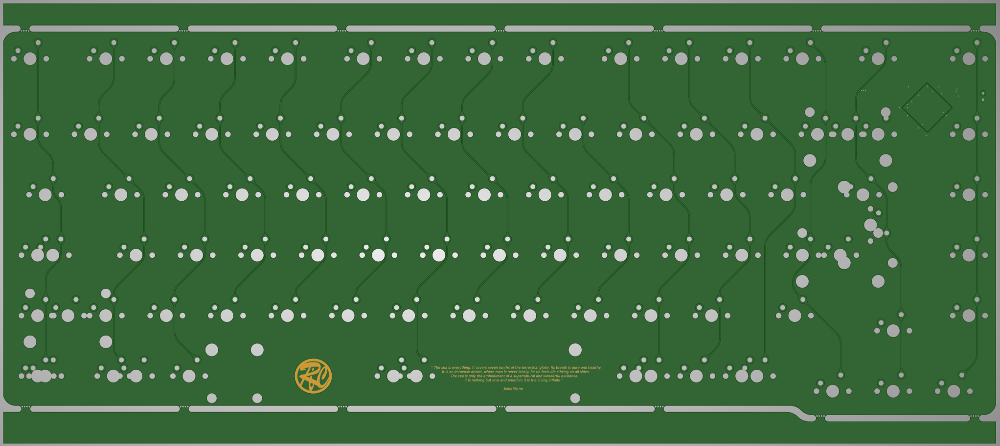
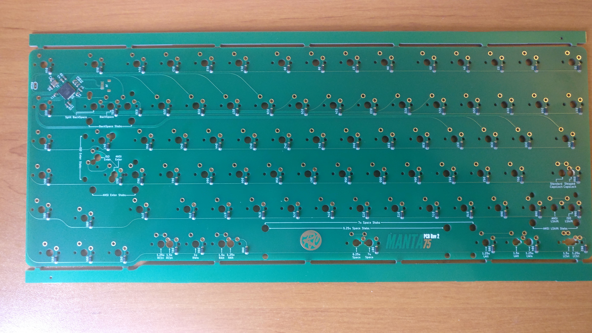
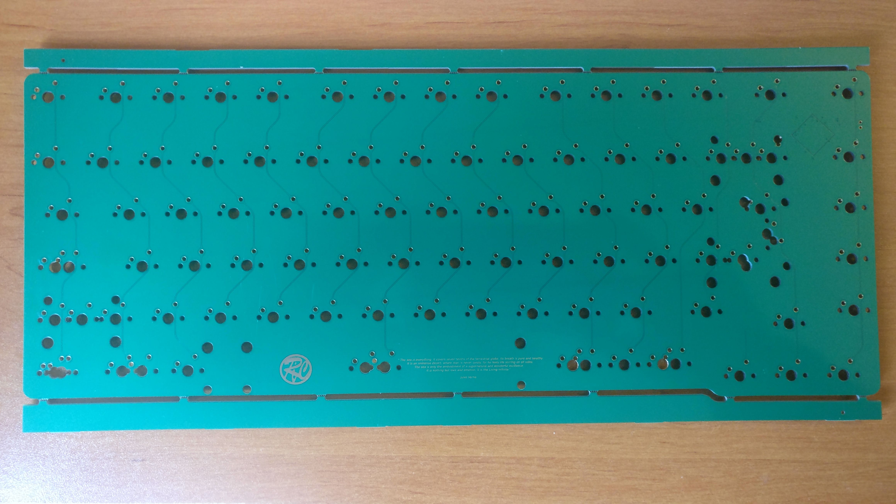

# PCB design

There have been two revisions of the PCB, Rev1 and Rev2.  
Both revisions are visually very similar and are electrically compatible so the same QMK firmware is used. 
The changes made for Rev2 have been:
- Cleaned the Kicad project so that it can be open sourced.
- Moved a few vias that were too close of some SMD pads.
- Added breakable tabs on top and bottom of the PCB.

## Rev2 PCB renders

## Rev2 PCB photos

