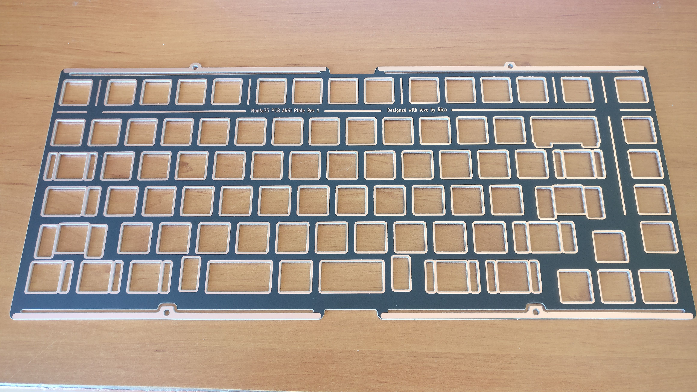

# Plate design and simulations

Plate leaf spring design and simulations have been done in Fusion 360.

## Design

Did several leaf spring designs that were not to my liking in the end.
After a few iterations I came with the top/bottom design that was a good candidate.

### Side leaf plate

I was concerned that using only two fixation points the plate assembly would not be stable enough so this has not been kept. 

### Diamond leaf plate

Good stability of the plate assembly with four fixation points.  
But the case design was not done and was not sure I wanted big side bezels, having leaves on the side would have forced me to do that so I did not keep this solution as well. 

### Top/bottom leaf plate

Good stability of the plate assembly with four fixation points and the possibility to have thin size bezels for the case if I wanted to in the future, this is the solution that I selected.  

## Simulation

### Simulation stategy

The goal is to perform simulations that are as accurate as possible to have a good understanding of how the leaves will perform in real life.  
Using the plate as is for simulations would not have given good results as the whole plate would bend by applying a force on it.  
I wanted displacement/deformation results on the leaves only as I expected it would happen in the real case, that is take into account the whole plate + PCB + switches assembly were switches act as pillars that makes this assembly very rigid.  
Simulating this assembly is obviously very complex so I came with a much simpler solution: make the plate thicker everywere (5mm) but not on the leaves (stays at 1.5mm).
I also placed some surface areas on the plate on were I intended to apply the forces.

  

### Simulation results

The plate has been locked on the four fixations points and is forced to deform under forces around them.  
Tests have been conducted by applying a 20N force (around 200g) at the four surface locations modelled on the simulation plate.  
The material selected has been aluminium 6061 and gravity (weight of the plate) has not been taken into account.  
Here are 3 of the 4 simulation results, showing displacements.

#### Center press

#### Left center press

#### Top left press

#### Results analysis

Top center is very similar than center left so is not included.
Displacement is uneven depending on where you apply force:
- 0.12mm for center.
- 0.14mm for top left.
- 0.35mm for center left.

I had also conducted the same simulations with the two leaves plate (side leaves) and had more uniform deformation values, but as I did not keep this solution it has been the same for the simulation results.  
We can deduce that the more you add leaves the stiffier it gets when you go to the center of the plate.  
Having four leaves looks to be a good middle ground.

## Real world tests

### Prototype plate (aluminium 5052)

### Test jig

### Results

The whole plate moves when applying force and the unevenness of bounce seen in simulation is hardly noticable when typing. This is very close to what I was expecting with the simulations.  
This is a very bouncy feeling when typing on it.  
Also tested with foam underneath the leaves at various locations (middle of leaves, and of leaves as in the picture, ...), the more you move the foam to the end of the leaves and the more you lose the bouncy feeling.

## Final plate (aluminium PCB)

This is the end result done with aluminium PCB manufacturing.

