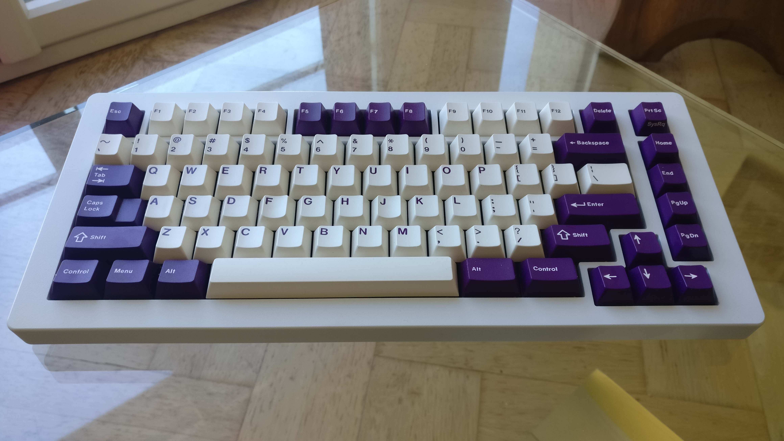

# The Manta75

The Manta75 is an exploded arrows and nav clusters 75% keyboard with a curvy bottom.
It is the second project of the *Sea Collection* and as such it's name is taken from one of the species we see in our oceans, the [Manta ray](https://en.wikipedia.org/wiki/Manta_ray).

The [Satisfaction 75](https://cannonkeys.com/collections/satisfaction-75) have this similar exploded arrows/nav clusters, on the manta75 I went with no knob and screen to maximize the number of available keys.

## Features

- Two pieces case designed with Fusion360.
- PCB designed with Kicad 5.1.5.
- Bottom mount leaf spring plate design with optional friction fit gaskets.
- [Unified C3 daughterboard](https://github.com/ai03-2725/Unified-Daughterboard)
- QMK firmware with VIA and VIAL support.

## Layout options

 

## Specifications

- Typing angle: 6 degrees
- Width: ~346mm
- Height: ~150mm
- Bezels size: 15mm all around.
- Front height: 18.3mm without bumpons, 19.7mm with bumpons.
- Top plate to top case distance: 7mm.
- Bumpons: 3M (reference SJ-5382). 
- Weight:
    - Aluminium top and bottom case: ~1,46Kg
    - Alumininum top and copper bottom case: ~4Kg

## Licensing 

[![CC BY 4.0][cc-by-shield]][cc-by]

Hardware design is provided under the very permissive
[Creative Commons Attribution 4.0 International License][cc-by].

[![CC BY 4.0][cc-by-image]][cc-by]

[cc-by]: http://creativecommons.org/licenses/by/4.0/
[cc-by-image]: https://licensebuttons.net/l/by/4.0/88x31.png
[cc-by-shield]: https://img.shields.io/badge/License-CC%20BY%204.0-lightgrey.svg

The goal is to allow anyone to use all hardware design files with the least restrictions possible.
This licence will allow you to make your own Manta75 and even use the hardware design files for commercial purposes.  

As for the QMK/VIA/VIAL firmware source code, it is provided on separate repositories, forks of QMK and QMK for Vial repositories.

## Design choices

### Layout

I wanted to type on the smallest layout possible but without sacrificing any usability for someone that has used no smaller than TKLs for a very long time.  

As a software engineer a keyboard is first and foremost a productivity instrument; as a result having arrow keys, nav keys and function keys without having to rely on layers is what I wanted.

75% layout seemed a good balance between compactness and usability, also wanted to separate arrow keys and nav cluster from the main keys.  
In the Manta75 you will find no screen, no knob and no badge, allowing to have a nav cluster of 5 keys instead of the usual 3 to 4 keys you can often find on other 75% keyboards. 

The goal ?  
Be able to use all my useful nav/arrow/function keys without having to rely on pressing a layer key.
The reason is that during programming sessions all those keys are already often used in combination with other mod keys (CTRL/SHIFT/ALT), adding a layer key press on top of that makes things difficult to manage (at least for me)

### Mounting

This is a leaf spring bottom mount design with only 4 fixation points.  
Having a bottom mount design makes installation of PCB/plate combo inside the case easy, even with the USB C daughterboard and JST cable. 

Gaskets can be optionally used below the leaves, friction fit placed in the bottom case.  
Length, position and material of the gaskets are up to personal preferences.
I personally uses Poron XRD of around 2cm length placed on the middle of the leaves, but it could be fun to play with other Poron types or even Sorbothane. 
No addhesive is needed to fix the gaskets as they are friction fit, the goal here is to be easily tuned to user preference and facilitate experimentation.

Physical simulations have been done in Fusion 360 to tune the thickness and length of the leaves.  
The result is a plate that is optimally tuned (to my taste) for aluminium material and that can be used without gaskets for maximum bounce.
For softer materials like FR4 the use of gaskets may be desirable.  

More details on plate design and Fusion 360 simulations can be found [HERE](PLATE_DESIGN.md).

### Case

#### Aestetics

There are 15mm bezels on all sides:
- I am a big sucker for thick bezels.
- This allowed me to accentuate the curvature on the bottom case significantly.
- Accentuating the bottom case curvature allows the screw holes not to be visible at side angles.

I wanted the bottom case to be very curvy with no obvious straight lines and to give the impression that the keyboard is floating on the desk, even from a side view of the board (the curvy bottom case helped a lot for that).

#### Functionality

The plate can move down up to 1.2mm, past that point it bottoms up on the bottom case to prevent excessive leaves distortion and switch pins shorting on the bottom case.  
There is a 1mm clearance between the plate and the top case for the plate to be able to tilt without touching it.   
There is 3.2mm clearance betweem PCB and bottom case so that the switch pins do not short the PCB when the plate is fully pressed.  
There are 4mm rails on the bottom case for optionally placing 3mm thick gaskets, those are loosely compressed by 0.2mm when the plate is assembled.

#### Machinability

Although quite curvy the case has been designed to be easily machined, even on a 3 axis CNC machine.
That does not mean it will be cheap to produce (those curves on the bottom case will take time to machine), more that there will be no big challenges for an average CNC manufacturer to make the case.

#### Picture galore

[Case renders](CASE_RENDERS.md)  
[Case received parts](CASE_PARTS.md)  
[Case photos](CASE_PHOTOS.md)

### PCB

The PCB is as simple as it can be:
- No RGB underglow.
- No per key lighting.
- Just the minimal features needed to have a stable working PCB for typing sessions.

This simplicity helped me a lot to achieve a goal that I wanted to pursue, an aestically pleasing PCB:
- Switch matrix column traces only on the top PCB.
- Switch matrix row traces and MCU traces only at the bottom PCB.
- Rounded traces with use of teardrops for switches holes.

To go further with aestetics I played with ground copper fills (only at the top PCB) and solder mask.  
This gives a bright solder mask color for the top of the PCB (because of the copper below it) and a darker solder mask color for the bottom of the PCB. This worked well on my green PCB prototypes and could work equally well for other semi-translucent solder mask colors like red, yellow, blue, violet, ...

To be user friendly all modifiers that can have different configurations are properly labelled on the silk screen. 

As for the manufacturing care has been taken it could easily be made and assembled at JLCPCB:
- All components references are from JLCPCB or it's sister company LCSC.
- Most are basic JLCPCB components to make the manufacturing cost as small as possible.
- Even the JST connector could be assembled if they happen to have some in stock (easy to solder yourself otherwise).

More details about the PCB can be found [HERE](PCB_DESIGN.md)  

## Making your own Manta75

### Risks

- Please note that all files and information here are to be used at your own risk.
- CNC manufacturing is not for the faint-hearted:
  - One-off CNC manufacturing is very expensive.
  - CNC manufacturers can make mistakes that can result in an expensive and useless chunk of metal.

### Case manufacturing

#### The data files

STEP files and drawings of top and bottom parts are available in *Case* directory.

The drawings, while far from professionally done, contains all requested information for the parts to be done by a CNC manufacturer: 
- Units used for the design (millimeters).
- Requested tolerance standard to be used during manufacturing (ISO 2768 - fine).
- All threaded holes are properly specified.
- Asked for deburring after machining.

#### About parts clearance

There is 0.15mm clearance between top and bottom parts.   
This allows to compensate for:
- CNC machining tolerancing errors.
- Parts finishing that can add to the part final thickness.

This clearance value is not universal, it's value depends on several factors:
- The confidance in your CNC manufacturer to target the given tolerance standard.
- The selected finish for earch part, each finish type adds more or less thickness to your final part.

A clearance of 0.15mm was for me suitable for the following finishing scenarios:
- Powdercoated top + raw bottom (tested).
- Powdercoated top + anodized type II bottom (not tested).
- Hard anodized type III top + raw or anodized type II bottom (not tested).
- Anodized type II top + raw or anodized type II bottom (not tested).

If you want to widen or tighten the clearance value, please do it by modifying the top case part only.

#### Selecting a CNC manufacturer

CNC services are getting more and more common nowadays:
- Some people uses 3DHubs.
- Others uses Xometry (I used Xometry EU for my Manta75 cases and for a previous project).
- Others uses Chinese manufacturers.

Please be aware that in general 'very cheap' and 'high quality' does not go well together.  
If price is a concern a solution to lower price per unit significantly is to make several units. Even doing 3 to 5 units will trop the price significantly.

### PCB manufacturing 

Kicad project is available in *Pcb/Kicad* directory.  

PCB fabrication files are available in *Pcb/Fabrication* directory.  
Those are:
- Gerber files.
- Bill of material (BOM) file.
- Pick and place (CPL) file for the assembly process.
Those are in the format that JLCPCB manufacturer expects, for you to very easily order assembled PCBs from them.
The files may need tweaking and/or modifications if you plan to go with other PCB manufacturers.   

### Plate manufacturing

Available plates data is available in *Plates* directory, both in DXF and STEP format.  
Two versions are available:
- ANSI.
- ISO.

For those the layout options are limited to the following:
- 6.25u spacebar only.
- Left 1.25u CTRL/Win/ALT keys only.
- Right 1.5u CTRL/ALT keys only.
- Choice between standard or stepped Caps Lock.
- Choice between standard or split Backspace.

### QMK VIA/VIAL firmware

#### Source code repositories

QMK forked repository containing both default and VIA firmware source code for 'The Manta 75' is available at the following [link](https://github.com/mymakercorner/qmk_firmware/tree/the_manta75) in 'the_manta75' branch.

Vial-QMK forked repository containing both default VIA and VIAL firmware source code for 'The Manta 75' is available at the following  [link](https://github.com/mymakercorner/vial-qmk/tree/the_manta75) in 'the_manta75' branch.

#### Binaries

If you don't feel comfortable compiling QMK firmware yourself, brebuilt binaries for VIA and VIAL are available in the *Firmware* directory.  
VIA json file is also available to make the board recognised by VIA software.  
VIAL version of the firmware is compatible with both VIA and VIAL software.
